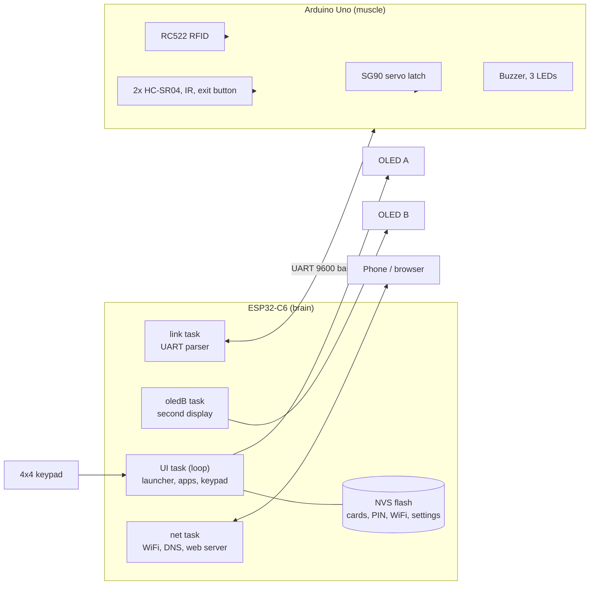

# Access OS

**A dual-microcontroller, RFID access-control system with a phone-style operating system, dual OLED displays, a captive-portal WiFi setup and a live web dashboard.**

Built by **Seleste Technologies** on an Arduino Uno and an ESP32-C6.


---

## Table of Contents

1. [Overview](#overview)
2. [Features](#features)
3. [System Architecture](#system-architecture)
4. [Tech Stack](#tech-stack)
5. [Bill of Materials](#bill-of-materials)
6. [Wiring and Connections](#wiring-and-connections)
7. [Inter-Board Protocol](#inter-board-protocol)
8. [Software Setup](#software-setup)
9. [First Run and Usage](#first-run-and-usage)
10. [Keypad Reference](#keypad-reference)
11. [Applications](#applications)
12. [Web Interface and API](#web-interface-and-api)
13. [Behaviour Reference](#behaviour-reference)
14. [Project Structure](#project-structure)
15. [Configuration](#configuration)
16. [Troubleshooting](#troubleshooting)
17. [Security Notes](#security-notes)
18. [Roadmap](#roadmap)
19. [License](#license)

---

## Overview

Seleste Access OS splits one access-control system across two boards, each doing what it is best at:

| Board | Role | Responsibilities |
|---|---|---|
| **ESP32-C6** | Brain | UI "operating system", two OLEDs, keypad, WiFi, captive portal, web server, card database, PIN and settings, access decisions |
| **Arduino Uno** | Muscle | RFID reader, servo door latch, buzzer, status LEDs, two ultrasonic sensors, IR beam, exit button |

The boards talk over a simple line-based serial protocol. The Uno reports events (a card was scanned, someone is near the door, the exit button was pressed). The ESP32 decides, and tells the Uno to grant or deny.

---

## Features

**Access control**
- RFID card enrollment and removal, stored in flash (up to 16 cards)
- Servo-driven door latch with configurable auto-relock (3, 5, 10 or 20 s)
- IR beam holds the door open while someone stands in the doorway and relocks shortly after they pass
- Exit push button for inside release
- Outside and inside ultrasonic sensors with a "visitor detected" event that wakes the screens
- PIN protection for door opening, card management and settings
- Event log (last 10 events, timestamped via NTP)

**Operating system**
- Icon-based launcher with 8 apps on a 128x64 OLED
- Phone-style multi-tap text entry for passwords and PINs
- Screensaver after 40 s of inactivity
- Persistent settings in flash (NVS)
- Four FreeRTOS tasks: UI, network, UART link and second display

**Dual OLED**
- OLED A is the interactive screen
- OLED B is a live dashboard (clock and status, sensor bars, event log)
- Wallpapers are drawn on one virtual 256x64 canvas, so animations travel across both displays

**Connectivity**
- Captive-portal WiFi provisioning (`Seleste-Setup` hotspot), plus on-device WiFi setup from the Settings app
- Web dashboard with live status, remote lock and unlock, and event log
- mDNS: reachable at `http://seleste.local`
- NTP time sync (UTC+3 by default)

---

## System Architecture



**Decision flow for a card scan**

1. The RC522 reads a tag and the Uno sends `C:<UID>` to the ESP32.
2. The ESP32 looks the UID up in its card list.
3. The ESP32 replies `G` (grant) or `X` (deny).
4. On grant, the Uno moves the servo, lights the green LED, plays the success tone and starts the relock timer.
5. Both boards log the result, and OLED B and the web dashboard update.

---

## Tech Stack

| Layer | Technology |
|---|---|
| Microcontrollers | ESP32-C6 (RISC-V, WiFi 6, 2.4 GHz), ATmega328P (Arduino Uno) |
| Language | C++ (Arduino framework) |
| RTOS | FreeRTOS (ESP32 Arduino core 3.x) with tasks and recursive mutexes |
| Graphics | U8g2 (full-buffer mode, hardware and software I2C) |
| RFID | MFRC522 library (RC522, 13.56 MHz, SPI) |
| Networking | `WiFi`, `WebServer`, `DNSServer` (captive portal), `ESPmDNS`, NTP via `configTime` |
| Storage | `Preferences` (NVS flash) for cards, PIN, WiFi credentials and settings |
| Actuation | `Servo` library, `tone()` for the passive buzzer |
| Inter-board link | UART, 9600 baud, 8N1, ASCII line protocol (`SoftwareSerial` on Uno, `Serial1` on ESP32) |
| Web front end | Vanilla HTML, CSS and JavaScript served from flash (no external dependencies) |
| Toolchain | Arduino IDE 2.x (or arduino-cli) |

### Required libraries

| Library | Used on | Source |
|---|---|---|
| esp32 board package (Espressif), version 3.x | ESP32-C6 | Boards Manager |
| U8g2 (olikraus) | ESP32-C6 | Library Manager |
| MFRC522 (GithubCommunity / Miguel Balboa) | Uno | Library Manager |
| Servo, SoftwareSerial, SPI | Uno | Built in |
| WiFi, WebServer, DNSServer, ESPmDNS, Preferences, Wire | ESP32-C6 | Built in with the ESP32 core |

---

## Bill of Materials

| Qty | Component | Notes |
|---|---|---|
| 1 | Arduino Uno | Access node |
| 1 | ESP32-C6 dev board | Main controller |
| 2 | 0.96" SSD1306 OLED, 128x64, I2C | For 1.3" SH1106 modules, change the constructors |
| 1 | 4x4 membrane keypad | Navigation and text entry |
| 1 | RC522 RFID reader with tags | 3.3V device |
| 1 | SG90 micro servo | Door latch |
| 2 | HC-SR04 ultrasonic sensors | Outside and inside |
| 1 | IR obstacle sensor (FC-51 type) | Doorway beam, LOW when blocked |
| 1 | Passive buzzer | Driven with `tone()` |
| 3 | LEDs (green, red, yellow) | Each with a 220 ohm resistor |
| 1 | Push button | Exit button |
| 3 | 220 ohm resistors | One per LED |
| 1 + 1 | 1 kohm and 2 kohm resistors | Level shifter on the Uno-to-C6 UART line |
| 1 | 470 uF capacitor | Across servo power, recommended |

---

## Wiring and Connections

> All grounds must be common: connect Uno GND to ESP32-C6 GND.
> Power each board from its own USB connection.

### Arduino Uno

| Function | Component pin | Uno pin |
|---|---|---|
| Link RX (receives from ESP32) | n/a | **D2** (from C6 GPIO18) |
| Link TX (sends to ESP32) | n/a | **D3** (to C6 GPIO21 via divider) |
| Buzzer | + leg (other leg to GND) | **D4** |
| Servo signal | Orange or yellow wire | **D5** |
| Green LED (door open) | Anode via 220 ohm | **D6** |
| Red LED (door locked) | Anode via 220 ohm | **D7** |
| Yellow LED (activity) | Anode via 220 ohm | **D8** |
| RC522 RST | RST | **D9** |
| RC522 SS | SDA | **D10** |
| RC522 MOSI | MOSI | **D11** |
| RC522 MISO | MISO | **D12** |
| RC522 SCK | SCK | **D13** |
| Ultrasonic 1 (outside) | TRIG / ECHO | **A0 / A1** |
| Ultrasonic 2 (inside) | TRIG / ECHO | **A2 / A3** |
| IR obstacle sensor | OUT | **A4** |
| Exit button | One leg (other to GND, internal pull-up) | **A5** |

**Power connections (Uno)**

| Component | Supply |
|---|---|
| RC522 VCC | **3.3V** pin (not 5V) |
| Servo (red wire) | 5V, with a 470 uF capacitor across power and ground |
| HC-SR04 x2 VCC | 5V |
| IR sensor VCC | 5V |
| All grounds | GND |

### ESP32-C6

| Function | Component pin | C6 GPIO |
|---|---|---|
| OLED A SDA | SDA | **GPIO22** |
| OLED A SCL | SCL | **GPIO23** |
| OLED B SDA | SDA | **GPIO20** |
| OLED B SCL | SCL | **GPIO19** |
| Keypad row 1 | Pin 1 | **GPIO0** |
| Keypad row 2 | Pin 2 | **GPIO1** |
| Keypad row 3 | Pin 3 | **GPIO2** |
| Keypad row 4 | Pin 4 | **GPIO3** |
| Keypad column 1 | Pin 5 | **GPIO6** |
| Keypad column 2 | Pin 6 | **GPIO7** |
| Keypad column 3 | Pin 7 | **GPIO10** |
| Keypad column 4 | Pin 8 | **GPIO11** |
| Link TX (to Uno D2) | n/a | **GPIO18** |
| Link RX (from Uno D3) | n/a | **GPIO21** (via divider) |
| OLED A and B VCC | VCC | 3V3 |
| OLED A and B GND | GND | GND |

All 14 GPIOs used are safe, non-strapping pins. Keypad pin order can differ between membranes. If keys appear scrambled, verify rows and columns with a multimeter and swap the groups.

### UART link and level shifter

The Uno's TX is 5V logic, but the ESP32-C6 is not 5V tolerant. Use a resistor divider on that one line:

```
Uno D3 ──[ 1 kΩ ]──┬── ESP32-C6 GPIO21
                   │
                 [ 2 kΩ ]
                   │
                  GND

ESP32-C6 GPIO18 ───────────── Uno D2        (3.3V into the Uno is read as HIGH, no shifter needed)
```

### RC522 note

The RC522 is a 3.3V device. Many builders drive it directly from the Uno's 5V logic and it works, but for long-term reliability add 1 kohm / 2 kohm dividers on MOSI, SCK, SS and RST.

### Pin budget at a glance

```
Uno:      D2 D3 D4 D5 D6 D7 D8 D9 D10 D11 D12 D13 A0 A1 A2 A3 A4 A5   (18 of 18 used; D0/D1 left free for USB)
ESP32-C6: 0 1 2 3 6 7 10 11 18 19 20 21 22 23                          (14 GPIOs, strapping pins avoided)
```

---

## Inter-Board Protocol

ASCII lines terminated by `\n`, 9600 baud, 8N1.

### Uno to ESP32-C6

| Message | Meaning |
|---|---|
| `H:1` | Hello, sent at boot. The ESP32 responds by re-sending configuration. |
| `C:<UIDHEX>` | RFID card scanned, UID in uppercase hex |
| `D:<out>,<in>` | Ultrasonic distances in cm (400 means no echo), every 300 ms |
| `I:0` or `I:1` | IR beam state (1 = blocked) |
| `B:1` | Exit button pressed |
| `S:0` or `S:1` | Lock state (1 = locked), sent on change and as a 5 s heartbeat |

### ESP32-C6 to Uno

| Command | Meaning |
|---|---|
| `G` | Grant: unlock, start relock timer, success tone |
| `X` | Deny: red flash and error tone |
| `L` | Lock now |
| `S<n>` | Play sound `n` (0 click, 1 success, 2 error, 3 alarm, 4 boot) |
| `R<sec>` | Set relock time in seconds (1 to 120) |
| `M0` / `M1` | Unmute / mute the buzzer |

The ESP32 treats the link as down if nothing is received for 3 seconds.

---

## Software Setup

### 1. Install tools

1. Install the **Arduino IDE 2.x**.
2. Add the Espressif board URL in *Preferences*, then install **esp32 by Espressif Systems** (version 3.0 or newer) from the Boards Manager.
3. In the Library Manager, install **U8g2** and **MFRC522**.

### 2. Flash the Uno

1. Open `uno_access_node/uno_access_node.ino`.
2. Select **Arduino Uno** and its COM port.
3. Upload. The buzzer plays a boot melody and the red LED lights up (locked).

### 3. Flash the ESP32-C6

1. Open `esp32c6_seleste_os/esp32c6_seleste_os.ino`.
2. Select **ESP32C6 Dev Module** and its port. Enable *USB CDC On Boot* if you want serial logs on the native USB port.
3. Upload. Both OLEDs show the boot splash, then the launcher appears on OLED A.

> The two sketches cannot be merged into one file. The Uno and ESP32 use different architectures and toolchains, so each board gets its own sketch.

---

## First Run and Usage

1. **PIN.** The default PIN is `1234`. Change it in *Settings > Change PIN*.
2. **WiFi (captive portal).** With no saved credentials, the C6 starts the open hotspot **Seleste-Setup**. Join it from your phone. The setup page opens automatically (or browse to `192.168.4.1`). Choose your network, enter the password and tap *Connect*.
3. **WiFi (on-device).** Open *Settings > Join WiFi network*, choose a network from the scan list and type the password with the keypad.
4. **Dashboard.** Once connected, open `http://seleste.local` or the IP shown in the *Info* app.
5. **Add a card.** Open *Cards* (PIN required), choose *[+] Add new card* and tap a tag on the reader.
6. **Use the door.** Tap an enrolled card, press the exit button, or use the Door app or the dashboard.

---

## Keypad Reference

| Key | Navigation | Text entry mode |
|---|---|---|
| **2** | Up | Letters (multi-tap) |
| **8** | Down | Letters (multi-tap) |
| **4** | Left | Letters (multi-tap) |
| **6** | Right | Letters (multi-tap) |
| **5** or **#** | OK / select | **#** confirms |
| **\*** | Back | Backspace |
| **A** | Home (any screen) | Cancel |
| **B** | Cycle OLED B view | Toggle upper/lower case |
| **C** | Lock the door now | Toggle abc / 123 mode |
| **D** | Mute / unmute sound | Show / hide text |

In text entry, digit keys cycle through letters like an old mobile phone: `2` = a, b, c, 2. Key `1` holds punctuation (`. , @ - _ ! ? # $ %` and `&`) and `0` holds space and 0.

---

## Applications

| Icon | App | Description | PIN |
|---|---|---|---|
| Padlock | **Door** | Live lock state and distances. `#` opens or closes the lock. | To open |
| Card | **Cards** | List, enroll and remove RFID cards | Yes |
| Radar | **Radar** | Bars for both distances and IR beam state | No |
| Document | **Log** | Scrollable event history | No |
| Picture | **Wallpaper** | Pick a wallpaper, shown across both screens | No |
| Snake | **Snake** | Classic game, speeds up as you score | No |
| Gear | **Settings** | WiFi, portal, PIN, relock time, sound, brightness, reboot | Yes |
| Info | **Info** | IP, WiFi name, link status, heap, uptime | No |

A successful PIN entry stays valid for 60 seconds.

### Wallpapers

Stars, Rain, Waves, Ball, Grid and Sweep. Each is rendered against a 256x64 virtual canvas. OLED A draws the left half and OLED B the right half, so motion continues seamlessly between screens.

### OLED B views (key B)

| View | Content |
|---|---|
| 0 | Clock, door state, network and last event |
| 1 | Distance bars, IR state, Uno link status |
| 2 | Recent events |
| 3 | Right half of the wallpaper |

---

## Web Interface and API

| Method | Path | Description |
|---|---|---|
| GET | `/` | Dashboard (or the WiFi setup page while in portal mode) |
| GET | `/setup` | WiFi setup page |
| POST | `/save` | Submit WiFi credentials (`ssid`, `manual`, `pass`) |
| GET | `/api/status` | JSON status |
| POST | `/api/unlock` | Unlock, form field `pin` |
| POST | `/api/lock` | Lock, form field `pin` |

Example status response:

```json
{
  "locked": 1,
  "d1": 123,
  "d2": 400,
  "ir": 0,
  "link": 1,
  "cards": 3,
  "log": ["14:02 OK 3A9F01C2", "14:00 Door locked"]
}
```

Three wrong PINs lock out web commands for 30 seconds.

---

## Behaviour Reference

### LEDs

| LED | Meaning |
|---|---|
| Red | Door locked (flashes quickly on denied access) |
| Green | Door unlocked |
| Yellow | Card read, or a person within 40 cm of the outside sensor |

### Sounds

| ID | Sound | Used for |
|---|---|---|
| 0 | Short click | Key presses, card read |
| 1 | Rising two-tone | Access granted, card added |
| 2 | Low descending tone | Access denied, wrong PIN |
| 3 | Alarm sweep | Reserved for alerts |
| 4 | Three rising notes | Boot |

### Door logic

- After a grant, the door relocks when the timer expires.
- While the IR beam is blocked, the timer is held, so the door never relocks on someone in the doorway.
- Once the beam clears after a person passes, the door relocks after about 1.5 s.
- The servo only receives power while moving and detaches afterwards to avoid jitter and heat.
- The ESP32 logs a "Visitor" event when the outside sensor reads under 35 cm (rate limited to once per 15 s).

### FreeRTOS tasks (ESP32-C6)

| Task | Priority | Stack | Purpose |
|---|---|---|---|
| `loop` (UI) | 1 | default | Keypad scan, app logic, OLED A rendering |
| `link` | 2 | 3 KB | Parse messages from the Uno |
| `net` | 1 | 10 KB | WiFi state machine, DNS, web server |
| `oledB` | 1 | 4 KB | OLED B rendering |

Shared state (log, card list, settings) is protected by a recursive mutex.

---

## Project Structure

```
seleste-access-os/
├── README.md
├── esp32c6_seleste_os/
│   └── esp32c6_seleste_os.ino     # ESP32-C6: OS, UI, WiFi, web, link
└── uno_access_node/
    └── uno_access_node.ino        # Uno: RFID, servo, sensors, buzzer, LEDs
```

---

## Configuration

Compile-time options at the top of each sketch.

**ESP32-C6**

| Define | Default | Purpose |
|---|---|---|
| `OLED2_SHARED_BUS` | `0` | Set to `1` to put both OLEDs on one I2C bus (second OLED jumpered to address 0x3D) |
| `UTC_OFFSET_SEC` | `3 * 3600` | Time zone offset for NTP (UTC+3, Nairobi) |
| `OLED_A_*`, `OLED_B_*`, `LINK_*`, `rowPins`, `colPins` | see wiring | Pin assignments |

**Uno**

| Constant | Default | Purpose |
|---|---|---|
| `ANG_LOCKED` / `ANG_OPEN` | 10 / 100 | Servo angles; adjust to your latch |
| `relockMs` | 5000 | Default relock time (overridden by the ESP32 setting) |

---

## Troubleshooting

| Symptom | Likely cause and fix |
|---|---|
| Link shows "DOWN" | Check common ground and that TX and RX are crossed. Confirm both sketches use 9600 baud. |
| Garbled link data | Servo motion can disturb SoftwareSerial. Add the 470 uF capacitor and keep the baud at 9600. |
| An OLED stays blank | Check I2C address (0x3C or 0x3D), SDA/SCL pins, and whether the module is SH1106 instead of SSD1306. |
| Both OLEDs share one image | You enabled `OLED2_SHARED_BUS` but both modules have the same address. |
| Keypad keys wrong | Row and column groups swapped. Swap the two arrays or the wires. |
| RFID never reads | RC522 must be on 3.3V. Recheck SPI wiring (D10 to D13) and RST on D9. |
| Servo jitters or Uno resets | Servo draws surge current. Add the capacitor or power the servo from a separate 5V supply sharing ground. |
| Setup page does not pop up | Browse manually to `192.168.4.1`. Some phones suppress captive pages on networks without internet. |
| Wrong time | NTP needs WiFi. Check `UTC_OFFSET_SEC`. Before sync, the clock shows uptime. |
| Cannot unlock from the web | Confirm the PIN. After 3 wrong attempts, wait 30 s. |

---

## Security Notes

- Change the default PIN `1234` before real use.
- The web dashboard uses plain HTTP and sends the PIN unencrypted. Keep it on a trusted local network, never exposed to the internet.
- The setup hotspot is open while in portal mode. Complete setup promptly.
- The ESP32 makes the access decisions. If it is powered off, the Uno denies all cards (no offline fallback yet).
- RFID UIDs identify tags but can be cloned, so this system suits hobby, lab and light-duty use rather than high-security doors.
- The servo latch is a prototype mechanism. Do not rely on it for life-safety or fire-exit doors.

---

## Roadmap

- [ ] Flash the Uno from the ESP32 over serial (STK500) for combined deployments
- [ ] Offline fallback: a master card stored on the Uno
- [ ] Per-card names, schedules and access logs in flash
- [ ] HTTPS or token-based authentication for the dashboard
- [ ] Card management from the web interface
- [ ] OTA updates for the ESP32-C6
- [ ] MQTT integration

---

## License

Released under the MIT License. Add a `LICENSE` file to your repository to apply it.

---

**Seleste Technologies**
